<p align='center'>
    
</p>

<h2 align="center">
  <a href="https://meongtamjeongai.github.io/meongtamjeongai/">
    🌐 발표 프레젠테이션 바로가기 🌐
  </a>
</h2>


**Flutter, Terraform, FastAPI, Streamlit을 활용한 AI 기반 피싱 대응 훈련 플랫폼**

'멍탐정 AI'는 사용자가 AI 챗봇과의 대화를 통해 현실과 유사한 피싱 시나리오를 경험하고, 이에 대한 대응 능력을 안전하게 훈련할 수 있도록 설계된 서비스입니다. 이 프로젝트는 현대적인 DevOps 파이프라인과 효율적인 백엔드/프론트엔드 기술 스택을 기반으로 구축되었습니다.

---

## 🗓️ 프로젝트 타임라인
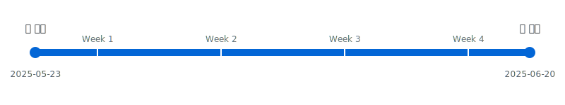

---

## 🧑‍💻 팀원 소개 (Our Team)

| 이름 | 담당 역할 |
| :---: | :--- |
| **김영범** | ⚙️ 백엔드<br>💻 프론트엔드 (어드민)<br>🚀 데브옵스 |
| **공진영** | 📱 프론트엔드 (Flutter 앱) |
| **한충현** | 🤝 운영 및 기술 지원<br>🧪 QA |

---

## 🚀 시연 영상 및 주요 결과

**🎬 [전체 기능 시연 영상 보러가기 (Google Drive)](https://drive.google.com/file/d/1CW1RFVTsZT1Ahi1aE7jT4XeDva7bOLPT/view?usp=sharing)**

<br>
<details>
<summary><strong>🖥️ ① 관리자 페이지 (Streamlit)</strong></summary>
<br>

*Python의 Streamlit 라이브러리만으로 제작된 관리자 페이지입니다. 사용자, 페르소나, 대화방 등 모든 데이터를 관리하고 AI 기능을 직접 테스트할 수 있습니다.*

| 로그인 | 사이드 메뉴 |
|---|---|
| 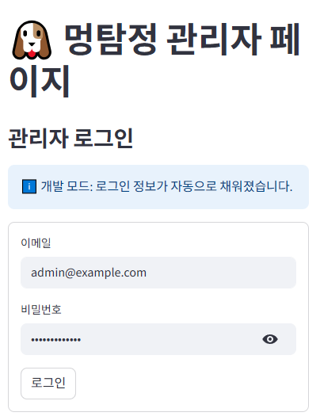 | 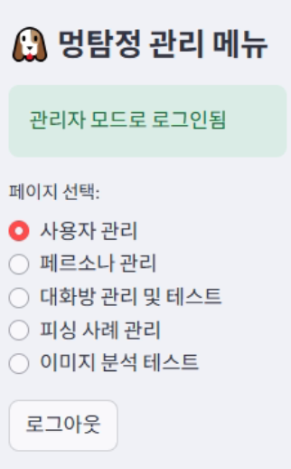 |

---

| 대화방 관리 | 대화방 메세지 |
|---|---|
| 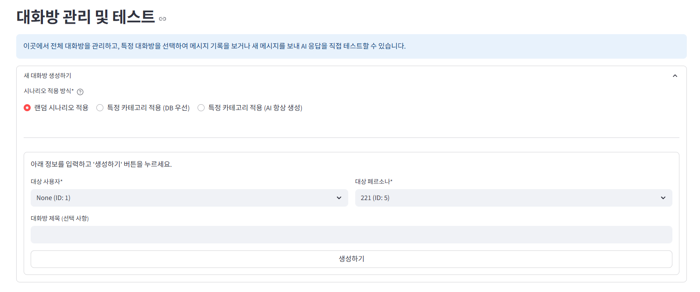 | 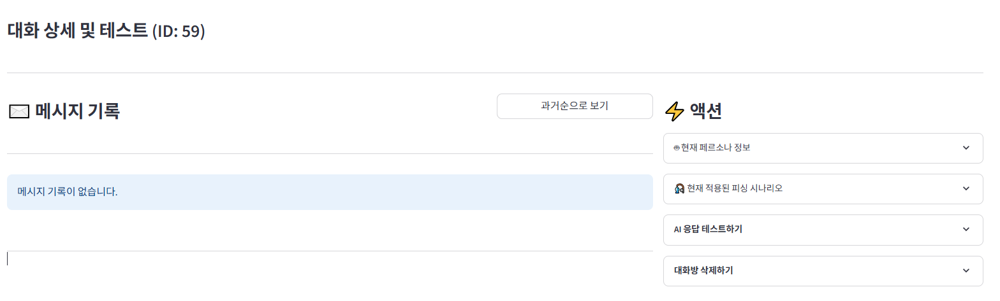 |

---

</details>

<details>
<summary><strong>📄 ② API 문서 (FastAPI + Scalar)</strong></summary>
<br>

*FastAPI가 Pydantic 모델을 기반으로 자동 생성한 인터랙티브 API 문서입니다. 모든 엔드포인트를 직접 테스트해볼 수 있습니다.*

| 메인 |
|---|
| 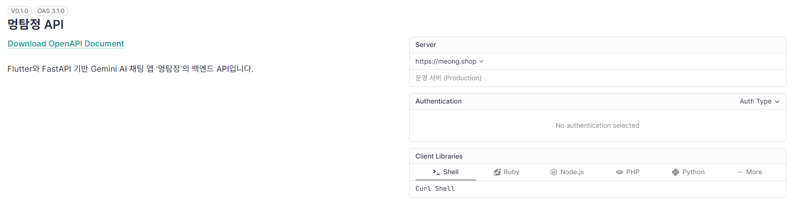 |

| 메뉴 |
|---|
| 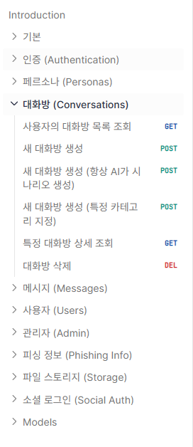 |

| 테스트 |
|---|
| 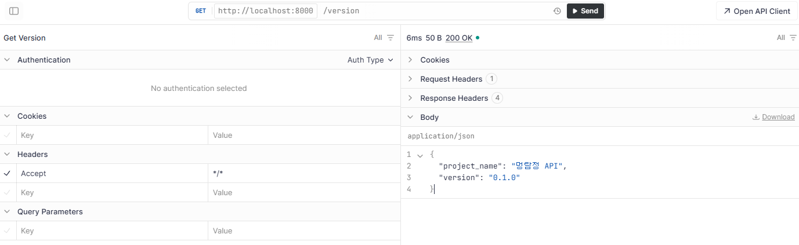 |

</details>

<details>
<summary><strong>☁️ ③ 인프라 관리 (Terraform Cloud)</strong></summary>
<br>

*GitHub과 연동된 Terraform Cloud 워크스페이스입니다. 코드 변경 시 자동으로 Plan/Apply가 실행되고 모든 배포 이력이 기록됩니다.*

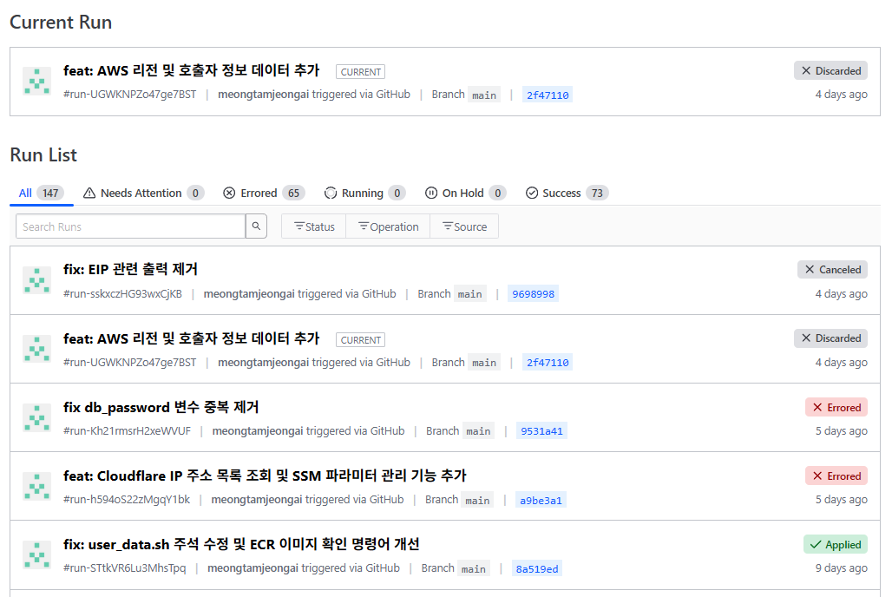

</details>

---

## ✨ 주요 특징 (Key Features)

-   **🤖 AI 기반 피싱 시뮬레이션:** Google Gemini AI를 활용하여 다양한 피싱 시나리오를 생성하고, 사용자와의 대화를 통해 훈련을 진행합니다.
-   **🛡️ 안전한 파일 업로드:** AWS S3 Presigned URL을 사용하여 서버 부하 없이 안전하게 이미지를 업로드합니다.
-   **🔑 다양한 소셜 로그인:** Google, Kakao, Naver 등 익숙한 소셜 계정을 통해 간편하게 로그인할 수 있습니다.
-   **🏗️ 코드형 인프라 (IaC):** Terraform을 사용하여 모든 AWS 인프라(VPC, EC2, RDS 등)를 코드로 정의하고 관리합니다.
-   **🔄 자동화된 CI/CD:** GitHub App/Actions 과 Terraform Cloud를 연동하여, 코드 Push 시 자동으로 테스트, 빌드, 배포가 이루어집니다.
-   **🐍 Python-Only 관리자 페이지:** 복잡한 프론트엔드 기술 없이, Streamlit만으로 데이터 관리 및 AI 테스트 페이지를 신속하게 구축했습니다.

---

## 🐾 프로젝트 저장소 목록 (Our Repositories)

| 저장소 (Repository) | 설명 (Description) | 상태 (Status) |
| :--- | :--- | :--- |
| 📱 **[meongtamjeongai-app](https://github.com/meongtamjeongai/meongtamjeongai-app)** | 플러터를 활용한 크로스플랫폼 모바일 앱 | [](https://github.com/meongtamjeongai/meongtamjeongai-app) [](https://github.com/meongtamjeongai/meongtamjeongai-app) |
| 🗄️ **[meongtamjeongai-backend](https://github.com/meongtamjeongai/meongtamjeongai-backend)** | FastAPI를 활용한  백엔드 API 서버 | [](https://github.com/meongtamjeongai/meongtamjeongai-backend) [](https://github.com/meongtamjeongai/meongtamjeongai-backend) |
| 🛠️ **[meongtamjeongai-admin](https://github.com/meongtamjeongai/meongtamjeongai-admin)** | Streamlit을 활용한 어드민 페이지 | [](https://github.com/meongtamjeongai/meongtamjeongai-admin) [](https://github.com/meongtamjeongai/meongtamjeongai-admin) |
| 🚀 **[meongtamjeongai-devops](https://github.com/meongtamjeongai/meongtamjeongai-devops)** | 테라폼을 활용한 AWS 인프라 구축 (IaC) | [](https://github.com/meongtamjeongai/meongtamjeongai-devops) [](https://github.com/meongtamjeongai/meongtamjeongai-devops) |

---

## 🗺️ 전체 아키텍처

이 프로젝트는 개발, 배포, 운영의 전 과정을 자동화하고, 각 구성 요소를 명확하게 분리하여 안정성과 확장성을 확보하는 것을 목표로 설계되었습니다.

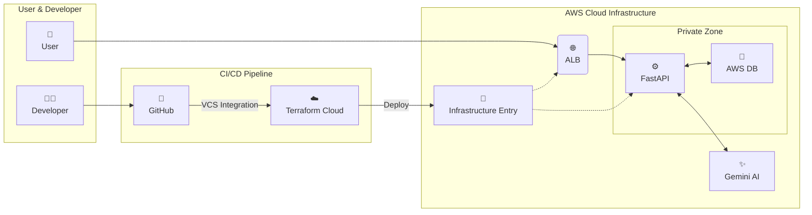

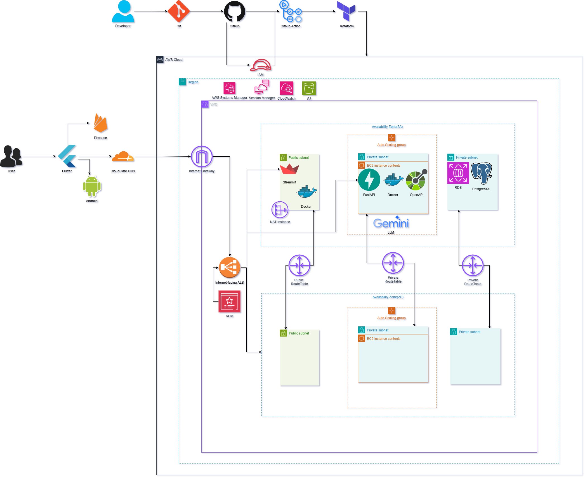

---

## 📦 ERD (Entity Relationship Diagram)

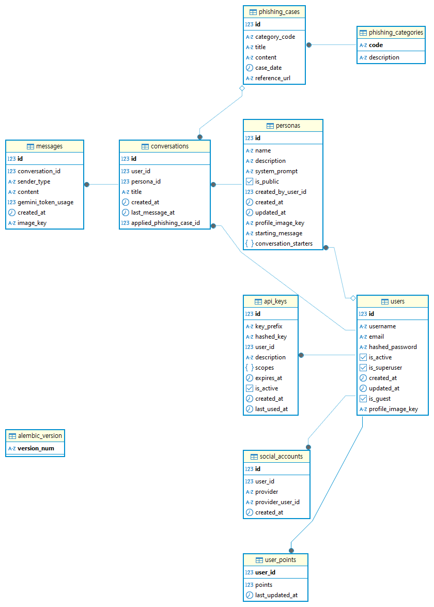

| Table Name | Description | Details |
|:--- |:---|:---|
| 🧑‍💻&nbsp;`users` | **사용자 계정 정보** | 시스템의 핵심 주체인 사용자를 나타냅니다. 로그인 정보, 프로필, 계정 상태 등을 저장합니다. |
| 🤖&nbsp;`personas` | **AI 페르소나 프로필** | 챗봇의 이름, 시스템 프롬프트, 프로필 이미지 등 AI의 정체성을 정의합니다. 하나의 페르소나는 여러 사용자와 상호작용할 수 있습니다. |
| 💬&nbsp;`conversations` | **대화 세션** | 사용자와 페르소나 간의 개별 대화방 정보를 담습니다. 대화 참여자와 메타데이터를 연결합니다. |
| 📜&nbsp;`messages` | **개별 메시지** | 대화방 내에서 오고 간 모든 메시지(사용자 입력, AI 응답)를 저장합니다. `sender_type` 필드로 발신자를 구분합니다. |
| 🎣&nbsp;`phishing_cases` | **피싱 시나리오** | 미리 정의된 다양한 피싱 공격 시나리오의 제목, 내용 등 상세 정보를 저장하며 시뮬레이션에 사용됩니다. |
| 🗂️&nbsp;`phishing_categories`| **피싱 유형** | 피싱 사례(`phishing_cases`)를 금융 사기, 기관 사칭 등 특정 유형으로 분류하여 체계적으로 관리합니다. |
| 🔑&nbsp;`api_keys` | **API 키 관리** | 외부 애플리케이션이나 서비스가 시스템 기능에 프로그래밍 방식으로 접근할 수 있도록 API 키를 관리합니다. |
| 🔗&nbsp;`social_accounts` | **소셜 로그인 연동** | 사용자가 구글, 네이버, 카카오 등 외부 소셜 계정을 사용하여 간편하게 로그인하거나 가입할 수 있도록 지원합니다. |
| ⭐&nbsp;`user_points` | **사용자 포인트 시스템** | 사용자 활동에 대한 보상 또는 점수 시스템을 관리합니다. 피싱 탐지 성공과 같은 활동에 대한 게임화(Gamification) 요소로 사용될 수 있습니다. |
| ⚙️&nbsp;`alembic_version` | **DB 마이그레이션 버전** | 데이터베이스 스키마의 변경 이력을 추적하고 업데이트를 관리하기 위해 Alembic 라이브러리가 사용하는 기술 테이블입니다. |

---

### 🧰 기술 스택 (Tech Stack)

**⚙️ Backend**

    

**🖥️ Frontend (Admin)**

 

**🧠 Database & AI**

  

**☁️ Infrastructure & DevOps**

    

**🔐 Authentication**

    

**💻 Development Env**

 

---

## 📂 프로젝트 구조

<details>
<summary><strong>⚙️ 백엔드 (FastAPI) 폴더 구조 보기</strong></summary>

```
meongtamjeongai-backend/
├── alembic/              # 데이터베이스 마이그레이션
├── app/
│   ├── api/              # API 엔드포인트 및 의존성
│   ├── core/             # 핵심 설정, 보안
│   ├── crud/             # 데이터베이스 CRUD 함수
│   ├── db/               # 데이터베이스 세션 관리
│   ├── models/           # SQLAlchemy DB 모델
│   ├── schemas/          # Pydantic 데이터 스키마
│   └── services/         # 비즈니스 로직
├── scripts/              # DB 초기화, entrypoint 스크립트
├── Dockerfile
├── docker-compose.yml
└── requirements.txt
```

</details>

<details>
<summary><strong>🖥️ 관리자 페이지 (Streamlit) 폴더 구조 보기</strong></summary>

```
meongtamjeongai-admin/
├── admin_app.py          # 메인 실행 파일, 페이지 분기
├── api/                  # 백엔드 API 호출 클라이언트
├── views/                # 각 페이지 UI 렌더링
├── Dockerfile
├── docker-compose.yml
└── requirements.txt
```

</details>

<details>
<summary><strong>☁️ 인프라 (Terraform) 폴더 구조 보기</strong></summary>

```
meongtamjeongai-devops/
├── modules/              # 재사용 가능한 인프라 단위 (VPC, EC2, RDS 등)
│   ├── acm/
│   ├── alb/
│   ├── ec2_backend/
│   └── ...
├── main.tf               # 전체 인프라 조립 (Root Module)
├── variables.tf          # 변수 정의
└── outputs.tf            # 출력값 정의
```

</details>

---

## 🛠️ 로컬 개발 환경 설정 (Getting Started)

이 프로젝트는 Docker와 Dev Container를 사용하여 간편하게 개발 환경 설정을 완료할 수 있습니다.

**사전 요구사항:**
-   [Git](https://git-scm.com/)
-   [Docker](https://www.docker.com/products/docker-desktop/)
-   [VS Code](https://code.visualstudio.com/)
-   [Dev Containers 확장 프로그램](https://marketplace.visualstudio.com/items?itemName=ms-vscode-remote.remote-containers)
-   (선택) [AWS CLI](https://aws.amazon.com/cli/): 로컬에서 AWS 리소스 상태를 직접 확인하고 싶을 경우에만 필요합니다.

**설정 단계:**

1.  **저장소 클론:**
    ```bash
    git clone https://github.com/meongtamjeongai/meongtamjeongai-backend.git
    cd meongtamjeongai-backend

    git clone https://github.com/meongtamjeongai/meongtamjeongai-admin.git
    cd meongtamjeongai-admin
    ```

2.  **환경 변수 파일 생성:**
    -   `meongtamjeongai-backend/.env.dev.example` 파일을 복사하여 `.env.dev` 파일을 생성하고, 내용을 채웁니다.
    -   `meongtamjeongai-admin/.env.example` 파일을 복사하여 `.env` 파일을 생성하고, 내용을 채웁니다.

3.  **공용 Docker 네트워크 생성:**
    ```bash
    docker network create meong
    ```

4.  **Dev Container 실행:**
    -   VS Code에서 `meongtamjeongai-backend` 폴더를 엽니다.
    -   `Ctrl + Shift + P`를 눌러 명령 팔레트를 열고, `Dev Containers: Reopen in Container`를 선택합니다.
    -   (최초 실행 시 Dev Container 빌드에 몇 분 정도 소요될 수 있습니다.)

5.  **데이터베이스 마이그레이션:**
    -   새 터미널을 열고 아래 명령어를 실행하여 DB 스키마를 최신 상태로 업데이트합니다.
    ```bash
    alembic upgrade head
    ```

7.  **접속 확인:**
    -   **백엔드 API 문서:** [http://localhost:8000/scalar](http://localhost:8000/scalar)
    -   **관리자 페이지:** [http://localhost:8501](http://localhost:8501)

---

## ☁️ 인프라 관리 및 배포 (Infrastructure Management)

이 프로젝트의 모든 인프라는 Terraform과 Terraform Cloud를 통해 코드로 관리되며, GitHub에 Push하는 것만으로 배포가 트리거됩니다.

### 1. Terraform Cloud 설정

-   **워크스페이스:** 모든 인프라 상태(state)는 [Terraform Cloud의 `meongtamjeongai-devops` 워크스페이스](https://app.terraform.io/app/meongtamjeongai/workspaces/meongtamjeongai-devops)에서 안전하게 관리됩니다.
-   **🔑 환경 변수:** `db_password`, `fastapi_secret_key` 등 모든 민감 정보는 Terraform Cloud 워크스페이스의 **Variables**에 `Environment variable` 타입으로, 그리고 **Sensitive**로 설정되어 있습니다. 소스 코드에는 어떠한 민감 정보도 포함되지 않습니다.

### 2. 로컬에서 인프라 변경 계획 확인 (선택 사항)

인프라 코드를 수정한 후, GitHub에 Push하기 전에 로컬에서 변경 사항을 미리 확인(`plan`)할 수 있습니다.

1.  **Terraform 설치:** 로컬 머신에 [Terraform](https://www.terraform.io/downloads)을 설치합니다.
2.  **Terraform 로그인:**
    ```bash
    terraform login
    ```
    -   브라우저가 열리면 Terraform Cloud에 로그인하여 토큰을 발급받습니다.

3.  **Plan 실행:**
    ```bash
    # 인프라 코드 디렉토리로 이동
    cd meongtamjeongai-devops

    # Terraform 초기화 (최초 1회 또는 프로바이더 변경 시)
    terraform init

    # 변경 계획 확인
    terraform plan
    ```
    -   이 명령은 실제 인프라를 변경하지 않고, 어떤 리소스가 생성, 수정, 삭제될지 미리 보여줍니다.

### 3. 실제 배포 워크플로우

1.  로컬에서 수정한 인프라 코드를 GitHub 저장소의 `main` 브랜치에 Push합니다.
2.  이 Push는 Github App을 통해 Terraform Cloud에 자동으로 전달됩니다.
3.  Terraform Cloud는 워크스페이스에서 `plan`을 실행하고, (설정에 따라) 관리자의 승인을 기다리거나 자동으로 `apply`를 진행하여 실제 AWS 인프라에 변경 사항을 적용합니다.
4.  모든 실행 과정과 결과는 Terraform Cloud UI에서 추적할 수 있습니다.

---

## 🧭 향후 계획 (Roadmap)

-   [ ] **테스트 코드 도입:** 단위/통합 테스트를 도입하여 시스템 안정성 확보
-   [ ] **아키텍처 개선:** 장기적 확장성을 위해 '도메인 중심 구조'로 점진적 리팩토링
-   [ ] **AI 경험 고도화:** 스트리밍 응답을 적용하여 실시간 채팅 경험 제공
-   [ ] **모니터링 및 캐싱:** 실시간 에러 로깅 및 캐싱 전략을 도입하여 성능 및 안정성 개선

---

## 📜 라이선스 (License)

이 프로젝트는 [MIT License](LICENSE) 를 따릅니다.